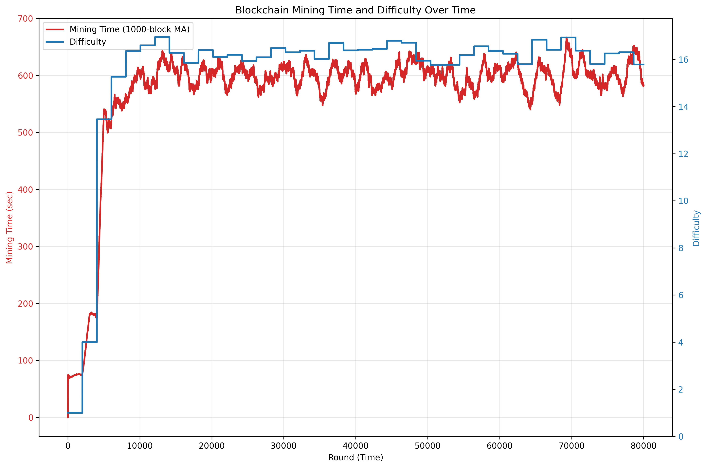

# Blockchain Simulator

A simulator for Proof-of-Work based blockchain such as Bitcoin and Ethereum (version 1.0).


Network topology:
- Complete graph
- Constant network delay

## Todo

- [x] Simulate [selfish mining](https://arxiv.org/abs/1311.0243)
- [ ] Simulate [time warp](https://bitcoinops.org/en/topics/time-warp/)
- [ ] Simulate [Uncle Maker](https://dl.acm.org/doi/10.1145/3576915.3616674)
- [ ] Uncle rewards in Ethereum
- [ ] [Longest chain rule](https://learnmeabitcoin.com/technical/blockchain/longest-chain/) (Currently literally the longest chain is chosen)

## Usage

```bash
# Run Ethereum protocol with 100 nodes for 10,000 rounds
RUST_LOG="info" cargo run --release -- --end-round 10000 --protocol ethereum --num-nodes 100

# Selfish mining experiment
RUST_LOG="info" cargo run --release -- --profile examples/selfish.json --end-round 100000

# Timewarp
RUST_LOG="info" cargo run --release -- --end-round 10000 --protocol bitcoin --profile examples/timewarp.json
```

## Experiments

Plot: difficulty and block generation time over time.




```bash
cd blockchain-sim

# Run simulations
cargo build --release
uv run python experiments/network_delay/scripts/run_delay_sweep.py --protocol=ethereum
uv run python experiments/network_delay/scripts/run_delay_sweep.py --protocol=bitcoin

# Plot difficulty over time
uv run python experiments/network_delay/scripts/plot_difficulty_curves.py --protocol=ethereum
uv run python experiments/network_delay/scripts/plot_difficulty_curves.py --protocol=bitcoin

# Plot block generation time and difficulty over time
uv run python experiments/network_delay/scripts/plot_mining_time_series.py experiments/network_delay/results/data/bitcoin-0.001.csv
uv run python experiments/network_delay/scripts/plot_mining_time_series.py experiments/network_delay/results/data/bitcoin-0.01.csv
uv run python experiments/network_delay/scripts/plot_mining_time_series.py experiments/network_delay/results/data/bitcoin-0.1.csv
uv run python experiments/network_delay/scripts/plot_mining_time_series.py experiments/network_delay/results/data/bitcoin-0.5.csv
uv run python experiments/network_delay/scripts/plot_mining_time_series.py experiments/network_delay/results/data/ethereum-0.001.csv
uv run python experiments/network_delay/scripts/plot_mining_time_series.py experiments/network_delay/results/data/ethereum-0.01.csv
uv run python experiments/network_delay/scripts/plot_mining_time_series.py experiments/network_delay/results/data/ethereum-0.1.csv
uv run python experiments/network_delay/scripts/plot_mining_time_series.py experiments/network_delay/results/data/ethereum-0.5.csv
```

その他の実験補助スクリプトは `experiments/README.md` に整理しています。

